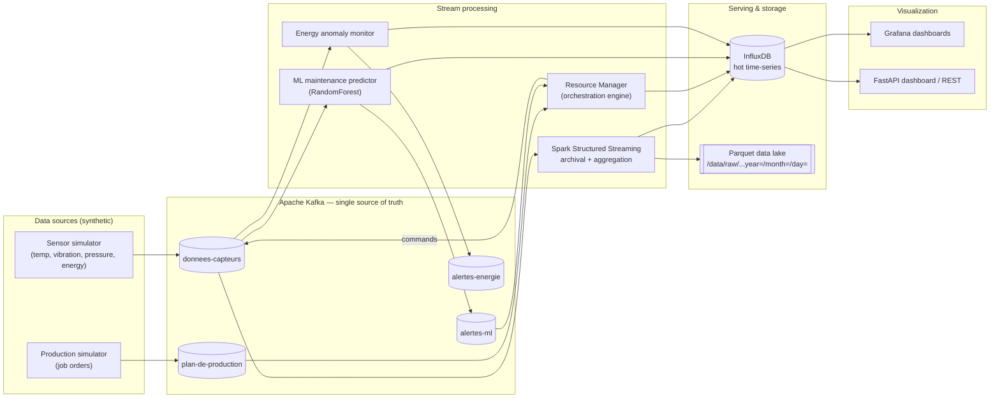
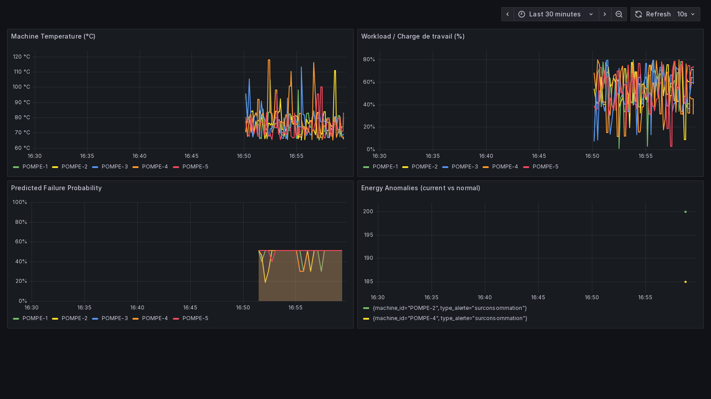
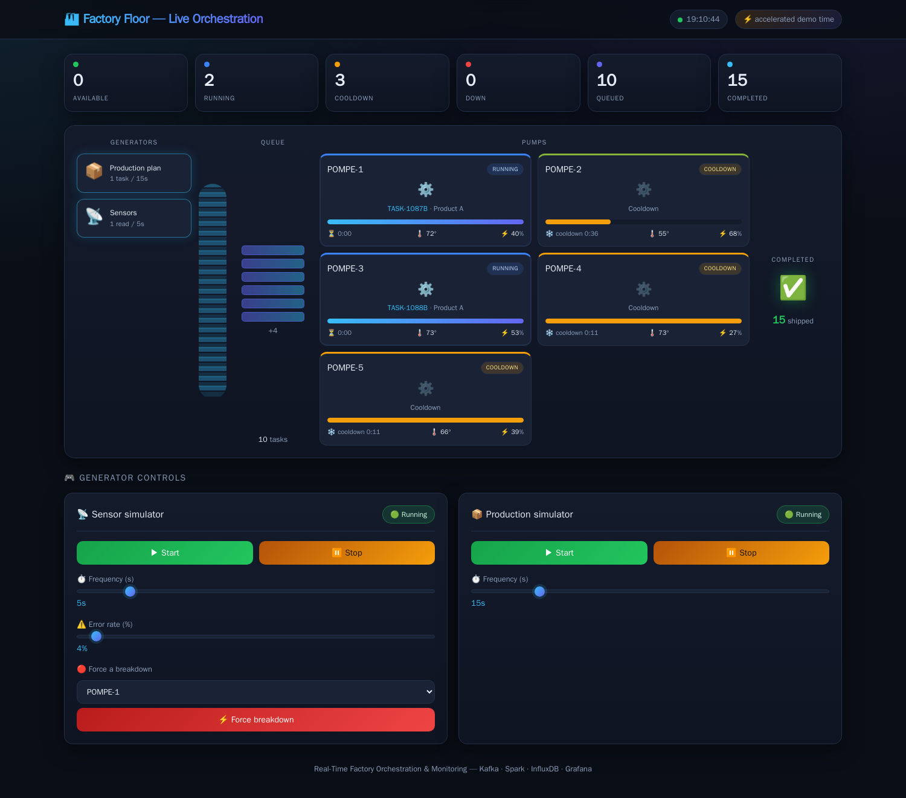

# Real-Time Factory Orchestration & Monitoring

A streaming data platform that supervises a fleet of industrial machines in real time: it ingests live sensor telemetry, predicts failures before they happen, detects energy anomalies, and **automatically orchestrates which machine runs which job** — pausing, repairing, and waking machines without a human in the loop. Everything is observable through Grafana and a built-in web dashboard, and every raw reading is archived to a Parquet data lake for model retraining.

> Built around Apache Kafka as the single source of truth, Apache Spark Structured Streaming for processing and archival, InfluxDB for the hot serving layer, and Grafana for visualization.

[](https://github.com/AhmedBelhouchette/kafka-fiesta/actions/workflows/ci.yml)


---

## The problem

On a factory floor, machines fail unpredictably, waste energy, and sit idle while a queue of production orders waits. Coordinating "which machine takes the next job, and which one needs to pause for maintenance" is usually manual, reactive, and slow. This project treats the floor as a **stream of events** and closes the loop automatically:

- **Predictive maintenance** — flag a machine *before* it breaks, from its live vibration/temperature/pressure signature.
- **Energy optimization** — detect overconsumption and leaks as they happen.
- **Intelligent orchestration** — assign the production queue to the best available machine, handle pause/repair/idle cycles, and wake machines back up when demand returns.
- **Real-time supervision** — a single pane of glass for operators.

## Architecture



**Data flow:** simulators emit telemetry and job orders → **Kafka** → Spark Structured Streaming archives every raw reading to the **Parquet data lake** and pushes aggregates to **InfluxDB**, the ML predictor and energy monitor raise alerts back onto Kafka, the **Resource Manager** consumes states + alerts + the job queue and orchestrates assignments → **Grafana** and the **FastAPI** UI read the hot data from InfluxDB.

## Dashboard

The provisioned Grafana dashboard, live off the running stack — machine temperature, workload, model-predicted failure probability, and detected energy anomalies:



The project also ships a built-in **live factory-floor** dashboard (FastAPI + vanilla JS): generators emit tasks that flow into the queue and onto the pumps, each pump shows a real-time progress bar, machines break down / pause / recover, and finished work ships to the "done" bin — all driven by the live API, on an accelerated demo clock:



## Tech stack

| Domain | Technology | Role |
| :--- | :--- | :--- |
| Language | Python 3.10 | Simulators, services, Spark (PySpark) jobs, API |
| Messaging | Apache Kafka 7.3 | Central event bus / single source of truth |
| Stream processing | Apache Spark 3.5 (Structured Streaming, standalone) | Kafka → Parquet archival + InfluxDB aggregation |
| Data lake | Parquet (HDFS-compatible partition layout) | Long-term raw storage for retraining |
| Serving DB | InfluxDB 2.7 | Hot time-series for dashboards |
| Visualization | Grafana | Operator dashboards & alerting |
| API / UI | FastAPI + Uvicorn | REST + built-in web dashboard |
| ML | scikit-learn (RandomForest) | Failure-type prediction |

> **Note on the data lake:** the design targets HDFS Parquet storage. To keep the project runnable on a single machine with one command, archival writes Parquet to a mounted volume using the **exact `year=/month=/day=` partition layout** specified in [`SPECIFICATIONS.md`](SPECIFICATIONS.md) — an HDFS-compatible layout that can be repointed at a real `hdfs://` or S3 path without code changes.

## Components

| Component | Path | What it does | Status |
| :--- | :--- | :--- | :--- |
| Sensor & production generators | `src/api/simulator_controller.py` | Run inside the API process (auto-started, controllable from the UI). Sensors follow a **degradation process** so the failure model sees real trends; **the synthetic data generator** lets anyone run the stack with no real factory data | ✅ Implemented |
| Resource Manager | `src/spark_jobs/resource_manager.py` | Real-time orchestration: task queue, machine selection, pause/repair/idle state machine, stats to InfluxDB | ✅ Implemented |
| ML maintenance predictor | `src/spark_jobs/ml_predictor_fixed.py` | Streaming failure prediction with a rules-based fallback | ✅ Implemented |
| Spark streaming archival | `src/spark_jobs/streaming/archival_job.py` | Kafka → partitioned Parquet lake + InfluxDB `etat_machines` | ✅ Implemented |
| Energy anomaly monitor | `src/spark_jobs/energy_monitor.py` | Detects overconsumption/leaks → `alertes-energie` + InfluxDB | ✅ Implemented |
| Model training + eval | `scripts/train_model.py`, `scripts/evaluate_model.py` | Run-to-failure simulation, grouped CV model selection, and a leakage-free evaluation that beats the baselines (see [Predictive-maintenance model](#predictive-maintenance-model)) | ✅ Implemented |
| FastAPI dashboard / REST | `src/api/` | Live machine/task/stat endpoints + web UI; controls simulators | ✅ Implemented |
| Grafana provisioning | `grafana/provisioning/` | Auto-wired InfluxDB datasource + factory dashboard | ✅ Implemented |
| Config layer | `src/common/config.py`, `.env` | All connection settings & credentials via env vars | ✅ Implemented |

## Repository layout

```
.
├── docker-compose.yml          # One-command stack (infra + app services)
├── Dockerfile                  # Spark + Python image for Spark/app containers
├── .env.example                # Copy to .env; all config lives here
├── requirements.txt
├── .github/workflows/ci.yml    # CI: tests + syntax + compose validation
├── tests/                      # pytest suite (feature parity, model, config, labels)
├── SPECIFICATIONS.md           # Data contract (Kafka/InfluxDB/HDFS schemas) — source of truth
├── grafana/provisioning/       # Datasource + dashboard auto-provisioning
├── scripts/                    # train_model.py + evaluate_model.py (PdM model)
├── models/                     # Pre-trained RandomForest + scaler
└── src/
    ├── api/                    # FastAPI app + web UI + generators (simulator_controller)
    ├── common/                 # Centralized env-based config
    └── spark_jobs/             # Resource manager, ML predictor, Spark streaming jobs
        ├── managers/  models/  services/  utils/  common/
```

## Quickstart

**Prerequisites:** Docker Desktop (with Compose v2). That's it — no local Python/Spark/Kafka needed.

```bash
# 1. Configure (the defaults are throwaway local-dev values; change for any real use)
cp .env.example .env

# 2. Bring up the whole stack
docker compose up --build
```

Then open:

| Service | URL | Notes |
| :--- | :--- | :--- |
| Web dashboard (FastAPI) | http://localhost:8000 | Live machines/tasks/stats |
| Grafana | http://localhost:3000 | Dashboards viewable anonymously; admin login from your `.env` (`GF_SECURITY_ADMIN_*`) |
| Kafdrop (Kafka UI) | http://localhost:9000 | Inspect topics & messages |
| InfluxDB UI | http://localhost:8086 | Login from your `.env` |
| Spark master UI | http://localhost:4040 | Streaming job status |

The simulators start producing automatically, so dashboards populate within a minute or two.

> **First run notes.** The full stack is ~14 containers. The first `--build` compiles one shared image, and the Spark streaming jobs download the Kafka connector (`spark-sql-kafka-0-10`) on first start, so allow a few extra minutes and ensure internet access. The streaming archival job runs against the standalone Spark cluster by default; if the cluster is unavailable on your machine, set `SPARK_MASTER=local[*]` for the `spark-streaming` service in `docker-compose.yml`.

## Predictive-maintenance model

The failure predictor is trained and **evaluated honestly**, not hand-waved:

- **Realistic data** — `scripts/train_model.py` simulates run-to-failure *degradation* (each machine accumulates wear stochastically and fails probabilistically). The label is the failure **horizon** (`maintenance` / `pause` / `none`), so the task is genuinely *predictive* rather than a threshold on the current reading.
- **Leakage-free evaluation** — data is grouped by machine-life *episode*; train and test never share an episode. Model selection is by **GroupKFold** cross-validation; class imbalance is handled with balanced weights. A RandomForest is selected over logistic-regression / gradient-boosting candidates.
- **It beats the baselines that matter** — on **unseen episodes** (`scripts/evaluate_model.py`):

  | macro-F1 (unseen episodes) | Score |
  | :--- | :--- |
  | **RandomForest (this model)** | **0.73** |
  | 3-line threshold rule (the fallback) | 0.56 |
  | Majority-class baseline | 0.17 |

  Operationally it catches **~87% of machines heading toward failure** (early-warning recall 0.87 at 0.89 precision; PR-AUC 0.82 for imminent failure). Top features are the rolling `vibration_mean` / `temperature_mean` / `temperature_max` — i.e. degradation *trends*, which is what a real predictor should key on.

Reproduce it end-to-end:

```bash
python scripts/train_model.py      # simulate, select, train -> models/*.pkl
python scripts/evaluate_model.py   # confusion matrix, per-class P/R/F1, baselines
```

> Honest caveat: these metrics are measured on the **simulated** degradation process, not real factory run-to-failure logs — the point is a *sound, reproducible evaluation methodology* (grouped split, baselines, imbalance handling), which is exactly what swapping in real data would need.

## Design goals (targets, not measured benchmarks)

These are the **objectives** the architecture is built to enable. They are **design targets, not measured results** — this repository does not yet ship a benchmark harness or a manual-vs-automated baseline that would substantiate them, and they should be read as goals rather than facts:

- **Reduce manual coordination effort** by closing the assign/pause/repair/wake loop automatically in the Resource Manager (target on the order of a ~50% reduction in manual coordination vs. a reactive manual process).
- **High availability** of the supervision pipeline (target 99.9%+), via Kafka durability, `restart: unless-stopped` services, and stateless, independently-restartable consumers.

Turning these into measured numbers (a coordination-effort baseline and an uptime SLO with monitoring) is tracked as future work.

## Data contract

[`SPECIFICATIONS.md`](SPECIFICATIONS.md) is the source of truth for all Kafka topic schemas, InfluxDB measurements, and the HDFS/Parquet partition layout. All services conform to it.

## License

[MIT](LICENSE) © 2026 Ahmed Belhouchette
