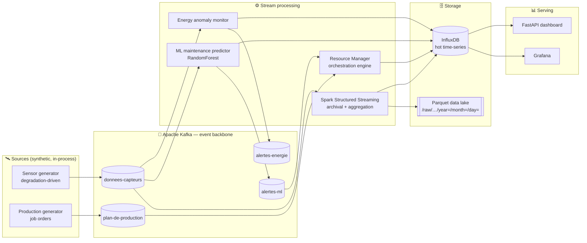
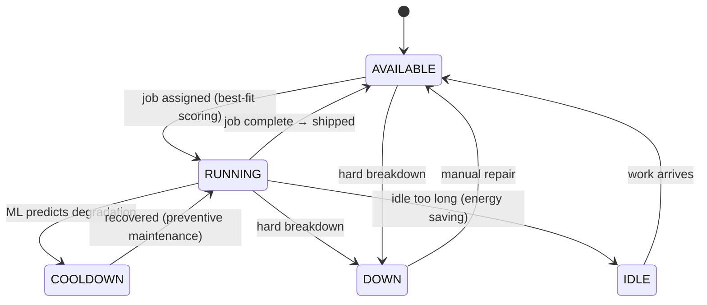

<div align="center">

# 🏭 Real-Time Factory Orchestration & Monitoring

**A streaming data platform that watches a fleet of industrial machines, predicts failures before they happen, and autonomously orchestrates the production line — end to end, in real time.**

[](https://github.com/AhmedBelhouchette/kafka-fiesta/actions/workflows/ci.yml)


</div>


> *The built-in live floor: generators emit jobs → the queue feeds 5 pumps → each pump shows real-time progress → finished work ships out. Machines that degrade are flagged by the ML model and cooled down before they fail; a hard breakdown stays **DOWN** until repaired. Everything below is driven by live data.*

---

## What this is

A production-shaped **Big Data + ML** system for predictive maintenance and intelligent resource allocation on a factory floor. Sensor telemetry and production orders stream through **Kafka**; **Spark Structured Streaming** archives every reading to a partitioned **Parquet data lake** and feeds the hot serving layer in **InfluxDB**; a **machine-learning model predicts failures from degradation trends**; and an **autonomous orchestrator** closes the loop — assigning jobs, triggering preventive maintenance, and managing the full machine lifecycle without a human in the loop. **Grafana** and a built-in **FastAPI** dashboard make all of it observable.

The whole thing — **13 services** — comes up with a single `docker compose up`.

### Why it's not a toy

| | |
| :--- | :--- |
| 🔄 **A genuinely closed loop** | A model predicts degradation → the orchestrator acts on it (preventive cooldown) → failures are avoided. Sensors, prediction, and action are wired together, not three disconnected demos. |
| 🧠 **Honest, rigorous ML** | Trained on a run-to-failure simulation with **failure-horizon labels**, evaluated **leakage-free** (grouped by machine-life), and it **beats its baselines** (0.72 macro-F1 vs 0.56 for a threshold rule). No fabricated 99% accuracy. |
| 🌊 **Real stream processing** | Apache Spark **Structured Streaming** (not a notebook) writing a date-partitioned Parquet lake *and* the InfluxDB serving layer from one job. |
| ⚙️ **Autonomous orchestration** | A real-time engine with a task queue, machine-fit scoring, and a full state machine (available → running → cooldown → down → repair). |
| 📦 **One command, reproducible** | `docker compose up` brings up Kafka, Spark, InfluxDB, Grafana, and the app services. Secrets via env, tests in CI. |

---

## Architecture



**Data flow:** generators emit telemetry + orders → **Kafka** → Spark archives every raw reading to the **Parquet lake** and pushes aggregates to **InfluxDB**; the ML predictor and energy monitor raise alerts back onto Kafka; the **Resource Manager** consumes machine state + alerts + the job queue and orchestrates the floor → **Grafana** and the **FastAPI** UI read the hot data.

### The machine lifecycle (the orchestrator's state machine)

This is the heart of the "intelligent orchestration." Every pump moves through a state machine the Resource Manager drives in real time:



> **COOLDOWN** auto-recovers (the model caught degradation early → preventive maintenance restores health). **DOWN** is a real fault and stays down until a human repairs it. That distinction — predict-and-prevent vs. fail-and-fix — is the whole point of predictive maintenance, and it's wired end to end here.

---

## 🧠 Predictive-maintenance model

This is the technical centrepiece, and it's done the way a real one should be.

**The trap most demos fall into** (this project included, originally): label data with a threshold on the *current* reading, train a model on it, and report ~100% accuracy. It's meaningless — the model just memorizes the rule. The original model here actually scored **worse than a 3-line `if`-statement**, keying on features that had no relationship to the label.

**The rebuild:**

- **Realistic data** — `scripts/train_model.py` simulates **run-to-failure degradation**: each machine accumulates wear stochastically and fails *probabilistically*. Sensors are noisy functions of wear, so a single reading is a *weak* signal — the **trend** is what matters.
- **Predictive labels** — the target is the failure **horizon** (`maintenance` / `pause` / `healthy`), so the model must predict *ahead*, not threshold the present.
- **Leakage-free evaluation** — data is grouped by machine-life *episode*; train and test **never share an episode**. Model selection is by **GroupKFold** cross-validation; class imbalance is handled with balanced weights. A RandomForest is selected over logistic-regression and gradient-boosting candidates.

**It beats the baselines that matter** — on entirely unseen machines (`scripts/evaluate_model.py`):

| macro-F1 (unseen episodes) | Score |
| :--- | :---: |
| **RandomForest (this model)** | **0.72** |
| 3-line threshold rule | 0.56 |
| Majority-class baseline | 0.17 |

Operationally it catches **~87% of machines heading for failure** (early-warning recall 0.87 at 0.89 precision; **PR-AUC 0.82** for imminent failure). The top features are the rolling `vibration_mean` / `temperature_mean` / `temperature_max` — degradation **trends**, exactly what a real predictor should rely on.

**Closed loop, live:** the running sensor generator follows the *same* degradation physics, so on the live floor the model genuinely predicts failures from rising trends, and the orchestrator acts on them — you can watch a pump heat up, get flagged, and be cooled down before it fails.

```bash
python scripts/train_model.py      # simulate → grouped CV select → train → models/*.pkl
python scripts/evaluate_model.py   # confusion matrix, per-class P/R/F1, baselines, PR-AUC
```

> **Honest caveat:** metrics are measured on the **simulated** degradation process, not real factory run-to-failure logs. The deliverable is a *sound, reproducible methodology* (grouped split, baselines, imbalance handling) — exactly what dropping in real data would require.

---

## Tech stack

| Domain | Technology | Role |
| :--- | :--- | :--- |
| Language | Python 3.10 | Generators, services, Spark (PySpark) jobs, API |
| Messaging | Apache Kafka 7.3 | Central event backbone |
| Stream processing | Apache Spark 3.5 — Structured Streaming | Kafka → Parquet lake + InfluxDB aggregation |
| Data lake | Parquet (HDFS-compatible partition layout) | Long-term raw storage for retraining |
| Serving DB | InfluxDB 2.7 | Hot time-series for dashboards |
| Visualization | Grafana | Operator dashboards + alerting |
| API / UI | FastAPI + Uvicorn | REST + live web dashboard |
| ML | scikit-learn (RandomForest) | Failure-horizon prediction |
| Orchestration | Docker Compose | 13-service one-command stack |

---

## Quickstart

**Prerequisite:** Docker Desktop (Compose v2). No local Python/Spark/Kafka needed.

```bash
git clone https://github.com/AhmedBelhouchette/kafka-fiesta.git
cd kafka-fiesta
cp .env.example .env          # throwaway local-dev defaults; change for any real use
docker compose up --build
```

Then open:

| Service | URL | What |
| :--- | :--- | :--- |
| 🏭 Live factory floor (FastAPI) | http://localhost:8000 | The animated dashboard above |
| 📊 Grafana | http://localhost:3000 | Time-series panels (viewable anonymously) |
| 🔎 Kafdrop | http://localhost:9000 | Inspect Kafka topics & messages |
| 🗄️ InfluxDB UI | http://localhost:8086 | Login from your `.env` |
| ⚡ Spark master | http://localhost:4040 | Streaming job status |

The generators auto-start, so dashboards populate within a minute or two.

<details>
<summary><b>First-run notes</b> (build time, Spark connector, cluster toggle)</summary>

The stack is ~13 containers. The first `--build` compiles one shared image, and the Spark streaming jobs download the Kafka connector (`spark-sql-kafka-0-10`) on first start — allow a few extra minutes and ensure internet access. The archival job runs against the standalone Spark cluster by default; if the cluster is unavailable on your machine, set `SPARK_MASTER=local[*]` for the `spark-streaming` service in `docker-compose.yml`.

</details>

---

## Screenshots

**Grafana — live time-series** (machine temperature, workload, predicted failure probability, energy anomalies):


The factory-floor dashboard (top of this README) is served by FastAPI and refreshes every few seconds: real progress bars, `RUNNING` / `COOLDOWN` / `DOWN` states with hover explanations, and working **Start/Stop**, **Force breakdown**, and **Repair** controls.

---

## Components

| Component | Path | What it does | Status |
| :--- | :--- | :--- | :---: |
| Sensor & production generators | `src/api/simulator_controller.py` | Degradation-driven telemetry + job orders, in-process & UI-controllable | ✅ |
| Resource Manager | `src/spark_jobs/resource_manager.py` | Real-time orchestration: queue, best-fit assignment, lifecycle state machine | ✅ |
| ML maintenance predictor | `src/spark_jobs/ml_predictor_fixed.py` | Streaming failure-horizon prediction (rules fallback) | ✅ |
| Spark streaming archival | `src/spark_jobs/streaming/archival_job.py` | Kafka → partitioned Parquet lake + InfluxDB `etat_machines` | ✅ |
| Energy anomaly monitor | `src/spark_jobs/energy_monitor.py` | Overconsumption/leak detection → `alertes-energie` + InfluxDB | ✅ |
| Model training + evaluation | `scripts/train_model.py`, `scripts/evaluate_model.py` | Run-to-failure sim, grouped CV, leakage-free eval | ✅ |
| FastAPI dashboard / REST | `src/api/` | Live floor + machine/task/stat endpoints | ✅ |
| Grafana provisioning | `grafana/provisioning/` | Auto-wired datasource + dashboard | ✅ |
| Config layer | `src/common/config.py`, `.env` | All connection settings & credentials via env | ✅ |

---

## Project structure

```
.
├── docker-compose.yml          # One-command stack (infra + app services)
├── Dockerfile                  # Spark + Python image for all containers
├── .env.example                # Copy to .env; all config lives here
├── .github/workflows/ci.yml    # CI: tests + syntax + compose validation
├── tests/                      # pytest: feature parity, model artifact, config, labels
├── scripts/                    # train_model.py + evaluate_model.py (PdM model)
├── grafana/provisioning/       # Datasource + dashboard auto-provisioning
├── models/                     # Trained RandomForest + scaler
├── SPECIFICATIONS.md           # Data contract (Kafka/InfluxDB/Parquet schemas)
└── src/
    ├── api/                    # FastAPI app, web UI, in-process generators
    ├── common/                 # Centralized env-based config
    └── spark_jobs/             # Orchestrator, ML predictor, Spark jobs
        ├── managers/  models/  services/  utils/  streaming/  common/
```

The full data contract — Kafka topic schemas, InfluxDB measurements, and the Parquet partition layout — is in [`SPECIFICATIONS.md`](SPECIFICATIONS.md).

---

## Engineering notes & design decisions

A few deliberate choices worth surfacing (the kind a reviewer would ask about):

- **Status as a single source of truth.** Machine status is written to *and read from* InfluxDB; the orchestrator excludes alert-blocked machines from assignment using an in-memory alert registry. (An earlier version read availability from a Kafka topic nothing published to — a bug this design replaces.)
- **Lossless consumers.** The orchestrator uses **persistent** Kafka consumers polled each batch, not per-batch throwaway consumers, so no tasks or alerts are dropped.
- **Pragmatic data lake.** The spec targets HDFS; to keep the project runnable on one machine, the archival job writes Parquet to a mounted volume using the **exact `year=/month=/day=` partition layout** — an HDFS-compatible path that can be repointed at `hdfs://` or S3 with no code change.
- **Reproducible model artifacts.** `models/*.pkl` are rebuilt by `scripts/train_model.py` and trained inside the runtime container so the serialized sklearn version matches production.
- **Train/serve parity is tested.** The single most valuable test (`tests/test_feature_parity.py`) asserts the 12 features computed at training time exactly match those computed at serving time — the drift that silently breaks ML systems.
- **Accelerated demo time.** Task durations, cooldowns, and the orchestration loop run on a fast clock (all in `.env`) so the full lifecycle is watchable in a short session; realistic production timings are a one-line change, documented in `.env.example`.
- **Secrets & hygiene.** All credentials are env-driven (gitignored `.env` + committed `.env.example`); no secrets, bytecode, or virtualenvs are tracked.

---

## Design goals (targets, not measured benchmarks)

The original brief set two headline objectives. They are **design targets the architecture enables — not measured results**, and are stated as goals, not facts:

- **Reduce manual coordination** by closing the assign / cooldown / repair loop automatically (target on the order of a ~50% reduction vs. a reactive manual process).
- **High availability** of the supervision pipeline (target 99.9%+) via Kafka durability, `restart: unless-stopped` services, and stateless, independently-restartable consumers.

Turning these into measured numbers (a coordination-effort baseline; an uptime SLO with monitoring) is tracked as future work.

---

## Roadmap

- Real run-to-failure datasets (e.g. NASA C-MAPSS) behind the same evaluation harness.
- Remaining-useful-life **regression** alongside the failure-horizon classifier.
- True HDFS/S3 backend for the data lake (the layout is already compatible).
- Grafana alerting rules wired to the energy/maintenance topics.
- A coordination-effort benchmark to substantiate the design goals above.

---

## License

[MIT](LICENSE) © 2026 Ahmed Belhouchette
